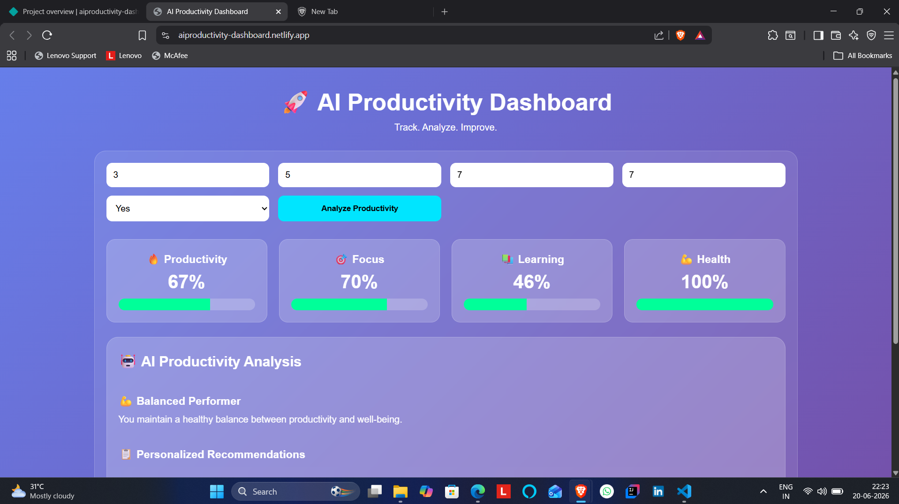
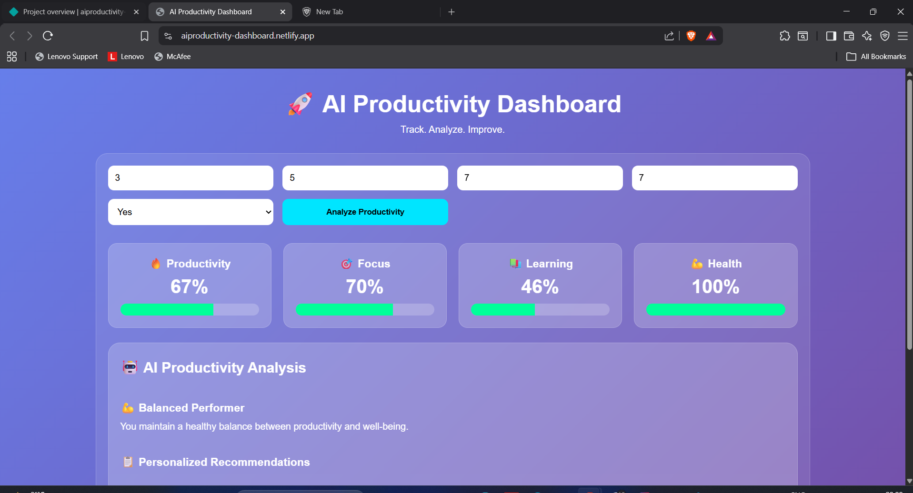
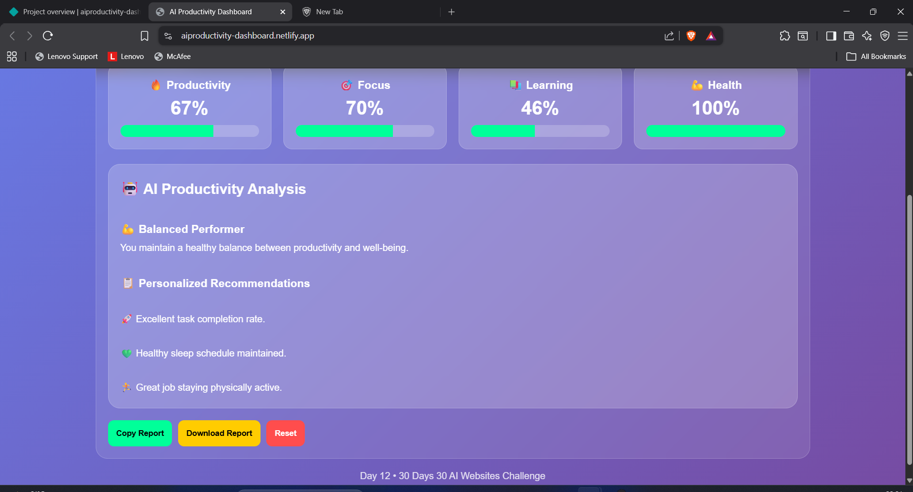

# AI Productivity Dashboard

## 🚀 Day 12 of my 30 Days 30 AI Websites Challenge

AI Productivity Dashboard helps students, developers, and professionals track their daily productivity, analyze their performance, and receive personalized recommendations to improve learning, focus, and overall productivity.

## 🌐 Live Demo

https://aiproductivity-dashboard.netlify.app/

## 📸 Screenshots

## ✨ Features

- Daily Productivity Analysis
- Productivity Score Calculation
- Focus Score Tracking
- Learning Score Evaluation
- Health Score Assessment
- AI Productivity Personality Detection
- Personalized Recommendations
- Progress Visualization
- Copy Report Feature
- Download Report Feature

## 📋 User Inputs

- Study Hours
- Tasks Completed
- Focus Level
- Sleep Hours
- Exercise Status

## 🎯 AI Productivity Personalities

🎯 Focus Master
🔥 Deep Worker
📚 Consistent Learner
💪 Balanced Performer
⚡ Fast Executor

## 🛠 Technologies Used

- HTML
- CSS
- JavaScript
- Built with the help of AI-assisted development tools

## 📋 How It Works
Enter daily productivity details.
Click Analyze Productivity.
### View:
- Productivity Score
- Focus Score
- Learning Score
- Health Score
- Productivity Personality
- Personalized Recommendations
- Copy or Download the generated report.

## 📌 Example

### Input:
Study Hours: 5
Tasks Completed: 7
Focus Level: 8
Sleep Hours: 7
Exercise: Yes

### Output:
Productivity Score: 92%
Focus Score: 80%
Learning Score: 74%
Health Score: 100%

### Personality:
🎯 Focus Master

### Recommendations:
• Great study consistency
• Outstanding focus level
• Healthy sleep schedule
• Great job staying physically active

## 🚀 Challenge

This project is part of my 30 Days 30 AI Websites Challenge where I build and publish one AI-assisted website every day.

## 📈 Progress

- Day 1 ✅ AI Resume Analyzer
- Day 2 ✅ AI Career Roadmap Generator
- Day 3 ✅ AI Project Idea Generator
- Day 4 ✅ AI Skill Gap Analyzer
- Day 5 ✅ AI Interview Question Generator
- Day 6 ✅ AI-Portfolio-Review-Analyzer
- Day 7 ✅ AI LinkedIn Post Generator
- Day 8 ✅ AI Salary Predictor
- Day 9 ✅ AI Startup Idea Validator
- Day 10 ✅ AI Study Planner
- Day 11 ✅ AI Tech Stack Recommender Pro
- Day 12 ✅ AI Productivity Dashboard

## 👨‍💻 Author

Bettam Anand

B.Tech CSE (Data Science)

JNTUH University College of Engineering Palair
